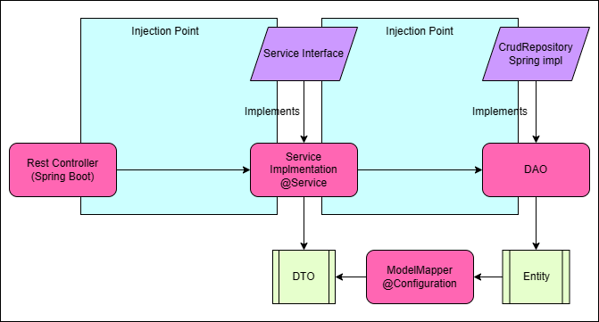

# Arrive Invoice Manager
<div align="center">
<p align="left">
   
</p>
</div>

This repository contains the source code for a REST API developed in Java using Spring Boot, Spring Data, Lombok, ModelMapper, and MySQL. This API is part of the Arrive application.

## Dependencies used
- Java 23
- Spring Boot 3.03
- Spring Data
- Lombok
- ModelMapper
- H2
- Maven

## Download and Configuration
To download this repository, you can clone it from the terminal using the following command:
```bash
git clone https://github.com/ammoraleso/InvoiceManager.git
```
Once you have the repository on your local machine, you can import it into your preferred IDE (e.g., IntelliJ IDEA or Eclipse) as a Maven project.

The H2 database will be created automatically when the project runs, and its console can be accessed here:
```bash
http://localhost:8080/h2-console/login.do
```

```properties
spring.datasource.username=admin
spring.datasource.password=admin

datasource.url=jdbc:h2:mem:management-system
```

## Swagger Documentation

The API endpoints can be accessed and tested using Swagger at the following URL:
http://localhost:8080/doc/swagger-ui/index.html

## Postman Collection
Inside the resource folder, you can download the full Postman collection to test the API.

## Testing Coverage
All the methods in the UserServices class (CRUD) are covered with passing tests.

## Architecture Diagram
Below is a diagram of the application architecture:


The application follows the MVC (Model-View-Controller) pattern, where Controllers handle HTTP requests, Services contain business logic and communicate with Repositories, and Repositories interact with the database.


## Run in local


## Useful Documentation

- [Spring Boot Official Documentation](https://docs.spring.io/spring-boot/docs/current/reference/htmlsingle/)
- [Spring Data Official Documentation](https://docs.spring.io/spring-data/jpa/docs/current/reference/html/#reference)
- [Lombok Official Documentation](https://projectlombok.org/features/)
- [ModelMapper Official Documentation](http://modelmapper.org/getting-started/)
- [MySQL Official Documentation](https://dev.mysql.com/doc/)
- [Maven Official Documentation](https://maven.apache.org/guides/index.html)